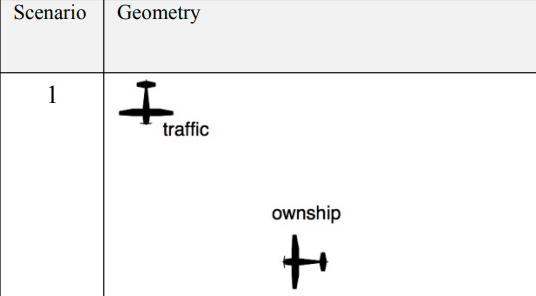
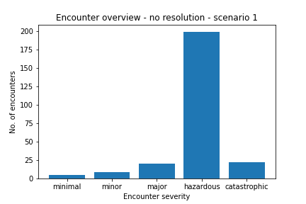
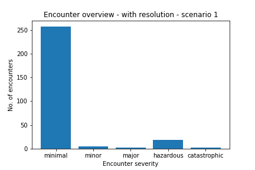

# VRF-DAIDALUS-CEI
NASA's DAIDALUS implemented in a VR-Forces plug-in.

## Prerequisites 

This plugin was built using the following:
 - VR-Forces 5.0 (Internal Product Build 15)
 - VR-Link 5.8
 - [MAK RTI 4.6 MSVC++ 14.0](https://vtmakcepstgagt01.blob.core.windows.net/productinstallers/makRti/releasesAndPatches/4.6%2B/4.6b/makRti4.6b-win64-vc14-20220411.exe)
 - Microsoft Visual Studio 2017, SDK version 10.0.17763.0, platform tools v141

Set the environment variables for VRL and RTI accordingly: MAK_VLRDIR and MAK_RTIDIR, and include MSVC++ directories to build the project properly.

## Usage

### Setting up the plugin

1. Compile NASA's DAIDALUS static library (included in the solution as a VS project named "DAIDALUS-LIB")
2. Compile the VRF plugin as a dynamic library (included in the solution as a VS project named "VRF-DAIDALUS-CEI")
3. Launch VRF and create a new plugin entry (this will create the plugin .xml), link it to the .dll file compiled on step 2.
4. Copy both the .lua file and the .xml file from VRF-scripts to VRF_DIR/data/simulationModelSets/EntityLevel/scripts to add the lua task.
4.1. Alternatively, import the script package.
6. Copy the .conf file from VRF-scripts to VRF_DIR/bin64/ to load DAIDALUS's configuration parameters.

### Using the plugin

The Daidalus object is created and initialized for every simulated object. At every tick, traffic data is fed into the object (daa.addTrafficState()). Conflict results and guidance parameters are then used together with VRF subtasks to move the aircraft. 

### Saving changes to Tasks

1. If the task is a system script, simply save the .lua file. The file can then be accessed directly in VRF_DIR/data/simulationModelSets/EntityLevel/scripts.
2. If the task is a scenario script, save the scenario. In order to access the file directly (either the script or the metadata), export the script using the context menu.

## Scenarios

All scenarios depicted here originate from NASA's Contract Report "Evaluation, Analysis and Results of the DANTi Flight Test Data, the DAIDALUS Detect and Avoid Algorithm, and the DANTi Concept for Detect and Avoid in the Cockpit" [^1].

### Scenario 1

Source: modified from [^1].

Ownship properties:
- Heading: 90deg, 1 degree standard deviation
- Latitude: 21:19.35 N, 50 meters s.d.
- Longitude: 157:51.74 W, 50 meters s.d.
- Altitude: 537 ft, 20 ft s.d.
- Horizontal speed: 60 kph, 5 kt s.d.

Traffic properties:
- Heading: 0deg
- Latitude: 21:18.39 N
- Longitude: 157:51.19 W
- Altitude: 550 ft
- Horizontal speed: 137 kt

## Simulation results

### Scenario 1 - no resolution

### Scenario 1 - instant resolution

## TODOs

- ~~Add some VRF scenarios as examples~~
- Get input from sensors, not from object list
- ~~Tinker with wrapper~~
- Add support for vertical speed maneuvers
- Add scenarios w/ climbing maneuvers
- Add and test wind support
- ~~Add resolution delay parameter~~
- Improve folder/project structure

[^1]: Carreño, Victor. Evaluation, Analysis and Results of the  DANTi Flight Test Data, the DAIDALUS  Detect and Avoid Algorithm, and the DANTi Concept for Detect and Avoid in the Cockpit. NASA/CR-20205004594, https://ntrs.nasa.gov/api/citations/20205004594/downloads/NASA-CR-20205004594Corrected%20CY.pdf. 
